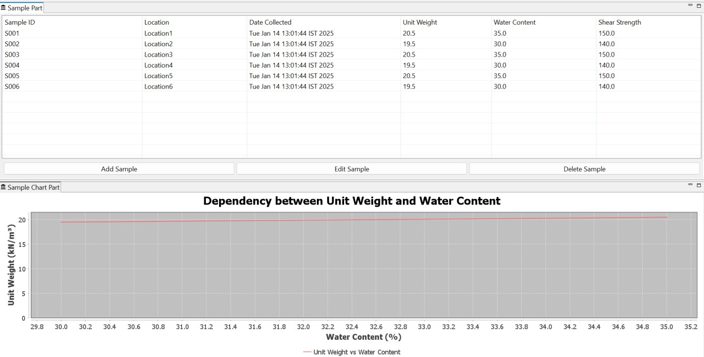

# Offshore Ground Sampling Application

This project is an Eclipse Rich Client Platform (RCP) and spring boot application designed to manage and analyze offshore ground sampling data.

## Table of Contents

- [Features](#features)
- [Software Prerequisites](#softwareprerequisites)
- [Technology Prerequisites ](#technologyprerequisites )
- [Installation](#installation)
- [Usage](#usage)

## Features

- **Sample Management**: Add, edit, and delete ground sampling data which includes information about:
  - Sample ID
  - Location
  - Date Collected
  - Unit Weight (kN/m³)
  - Water Content (%)
  - Shear Strength (kPa)
- **Data Validation**: Ensure input data adheres to specified ranges for accuracy.
- **Statistics**: View average water content and identify samples exceeding threshold values.
- **Optional Graph Visualization**: Displays the relationship between unit weight and water content.
- **API Access**: Rest end points to get sample data and statistics.

##Software Prerequisites

1. **Softwares Required:**:
- **Git**: [Download and install Git](https://git-scm.com/downloads)
- **Java 21 or higher**: [Download and install Java](https://www.oracle.com/java/technologies/downloads/)
- **Eclipse IDE for RCP and RAP Developers**: [Download Eclipse IDE](https://www.eclipse.org/downloads/packages/)
- **Postman**: [https://www.postman.com/downloads/]

## Technology Prerequisites 
- **Java** : It is used as primary language for the program.
- **Eclipse** : Eclipse RCP which is used primarily for UI creation.
- **Spring Boot** : It is used to create web application and container so rest end points can be accessed.
- **JPA/Hibernate** : its object relational mapping tool which is used to database interaction.
- **H2 Database** : Its a in memory database which is used to store application data.
- **JFreeChart** : It is used to generate graphs for the data.
- **Maven**[Optional] : To manage dependencies 

## Installation

1. **Clone the Repository**:
   ```bash
   git clone https://github.com/ajitkk87/rcp.git
   
   
## Usage

 **Launch Application**:

 - Import Project as an existing project in eclipse.
 - Open OffshoreGroundSampling.product and "Launch as Eclipse Application" or "Run as Eclipse Application". One can see Stand alone UI RCP UI by launching as Eclipse Application.


- Locate and open  OffshoreSpringBootApplication.java and "Run as Java Application". This will enable access to rest end points of application such as:
http://localhost:8080/offshoregroundsampling/samples
http://localhost:8080/offshoregroundsampling/locations
http://localhost:8080/offshoregroundsampling/statistics/average-water-content
- Alternatively postman collection can be imported from main/resources.
